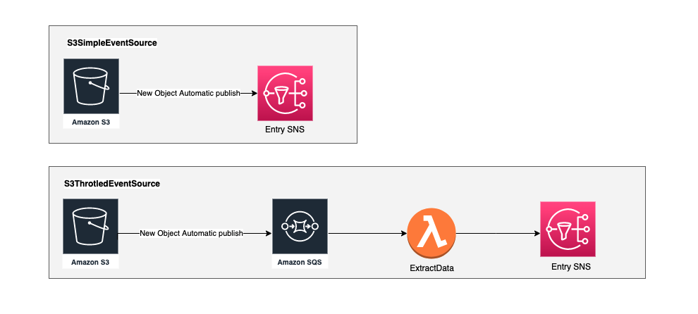

Plugin que adiciona um event source baseado em algum bucket s3 informado pelo usuário, pode ser um ARN de algum bucket já existente ou apenas o nome de um novo bucket a ser criado.

## Possíveis estruturas adicionadas a stack com o uso desse plugin

